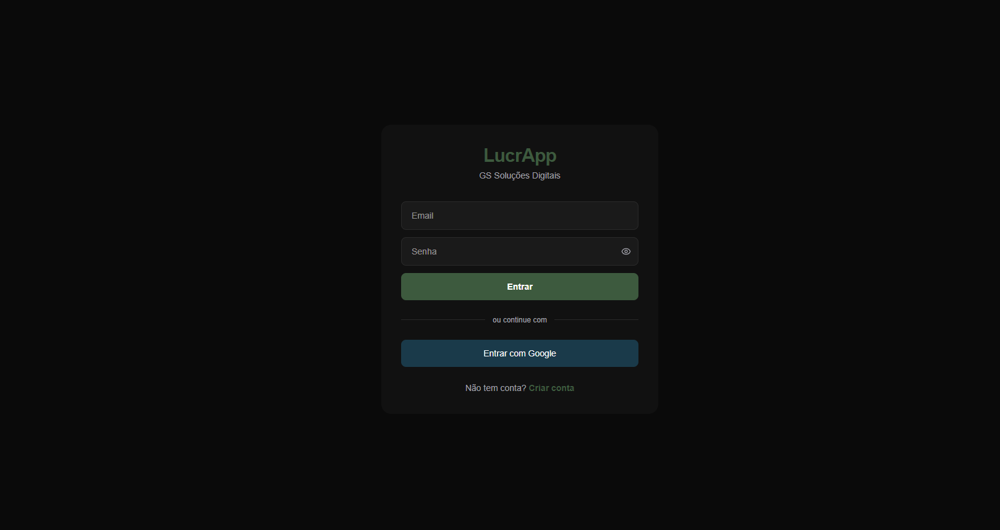
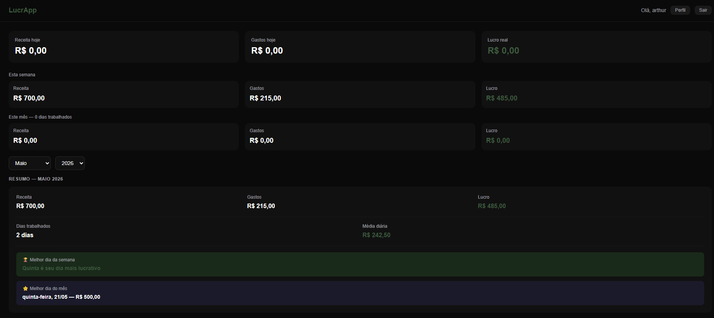
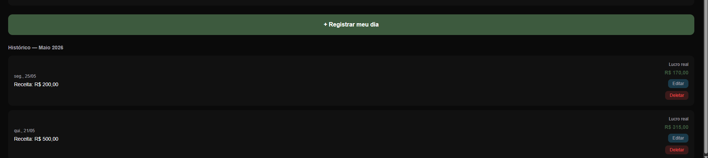

# LucrApp 💰

Painel financeiro para motoristas de aplicativo (Uber, 99, InDriver).

🔗 **Demo:** [lucrapp-iota.vercel.app](https://lucrapp-iota.vercel.app)

---

## O problema que resolve

Motoristas de app não sabem quanto realmente lucram. Calculam só a receita bruta e esquecem gasolina, alimentação e manutenção. O LucrApp registra tudo e mostra o lucro real do dia, da semana e do mês.

---

## Para quem é

Motoristas de Uber, 99 e InDriver que querem controlar suas finanças de forma simples, direto do celular.

---

## Telas

### Login


### Dashboard


### Histórico


---

## Funcionalidades

- Cadastro e login com email e senha
- Dashboard com receita, gastos e lucro do dia
- Registro diário com validação de duplicata
- Edição e exclusão de registros
- Filtro por mês e ano
- Resumo mensal com insights automáticos
- Melhor dia da semana e melhor dia do mês
- Tela de perfil com alteração de senha
- Sistema de planos (Gratuito e Plus)
- Proteção de rotas autenticadas

---

## Stack

| Tecnologia | Uso |
|---|---|
| Next.js 16 | Framework fullstack |
| TypeScript | Tipagem |
| Tailwind CSS | Estilização |
| Prisma | ORM |
| PostgreSQL + Supabase | Banco de dados |
| NextAuth.js | Autenticação |
| Vercel | Deploy |

---

## Como rodar localmente

```bash
git clone https://github.com/ArthurSanches-ds/lucrapp.git
cd lucrapp
npm install
```

Crie um arquivo `.env` na raiz:

```env
DATABASE_URL=
DIRECT_URL=
NEXTAUTH_SECRET=
NEXTAUTH_URL=http://localhost:3000
NEXT_PUBLIC_SUPABASE_URL=
NEXT_PUBLIC_SUPABASE_ANON_KEY=
```

```bash
npm run dev
```

---

## Desenvolvido por

[Arthur Sanches](https://github.com/ArthurSanches-ds) — GS Soluções Digitais